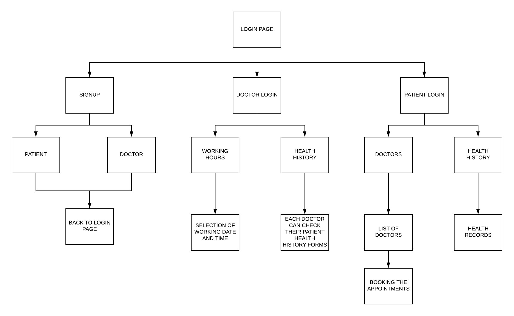

# MEDPHARM360
## MOBILE COMPUTING - EARLY MORNING - TEAM 06
### TEAM MEMBERS
- JASWANTHI NANNURU
- SANJANA BASWAPURAM
- HARSHAVARDHAN REDDY BOLLAM
- VAMSHIKRISHNA REDDY YEDALLA
### ABSTRACT
  MEDPHARM360 is the Android Application used by Doctors and Patients, where doctors can set the appointment times they are available and can look the previous Health History of their patients and Patients can book the appointments to meet their doctors and also can view their HealthRecord.
### GOALS OF THE APP
- MEDPHARM360 is a health related application.
- Doctors and Patients can Signup and Login into the application.
- Doctors can set their appointment timings and view the Patients health history.
- Health history shows the patients personal details and appointememt date and medication who already visited that particualr doctor.
- Patients can select the doctors and book the appointments at doctors.
- Patients also can view their helath history record.
### FLOW CHART

### ACCESSING CREDENTIALS
##### DOCTOR LOGIN
- __username__: doctor, __password__: doctor
##### PATIENT LOGIN
- __username__: patient, __password__: patient
### CONCLUSION
This App helps doctors and Patients in either way. Doctors use this Application to look at the Patients Previous History and Patients use this Application to book the appointment at doctor and also can view their Health Record.
